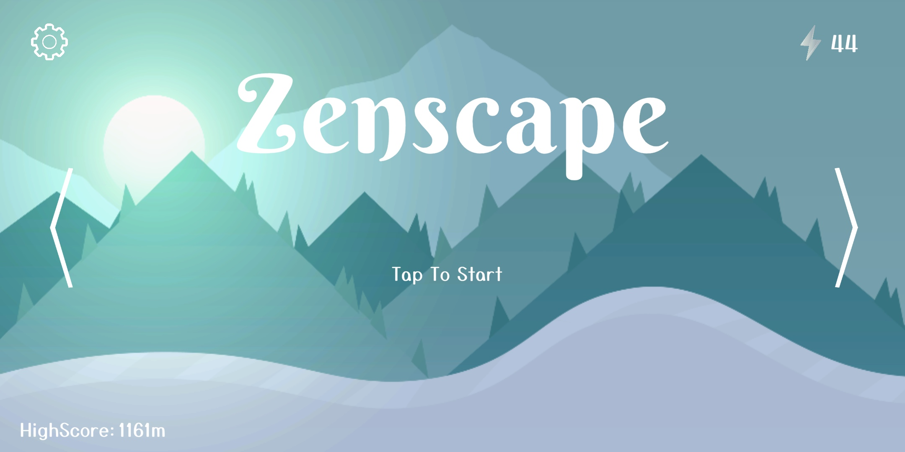
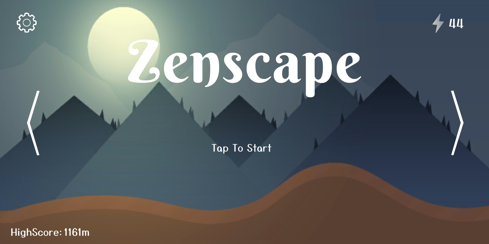
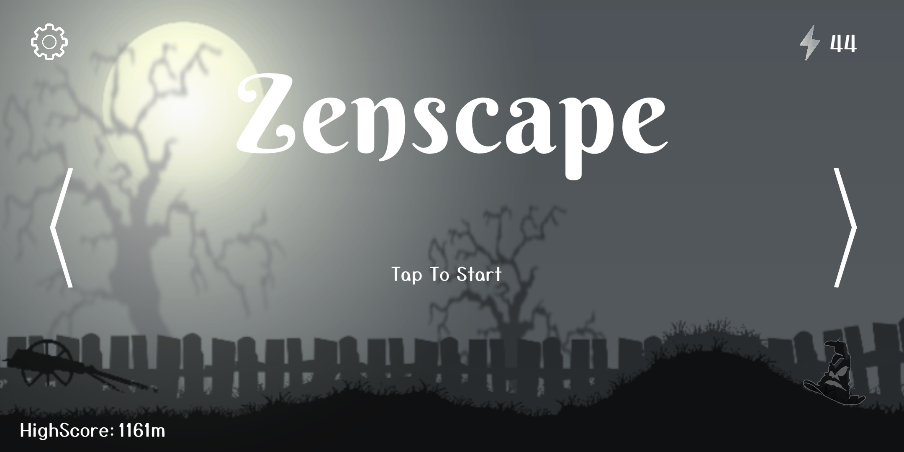
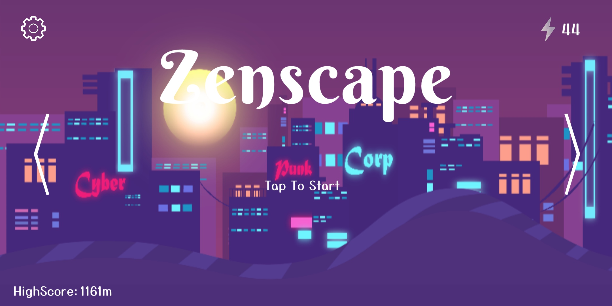
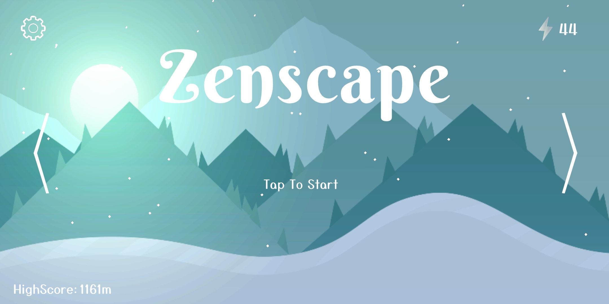

# Zenscape - A Game Build With Unity

## Table of contents

- [Overview](#overview)
- [Screenshots](#screenshots)

- [Built with](#built-with)

- [Authors](#authors)

## Overview

### Zenscape - A Game Build With Unity
Have what it takes to survive?
Download Zenscape now!

Little does our zen know that in a journey in search of strength he looses his way home. He has to make his way to find his path back through the ambient world.

Launching in....3 2 1 bam!!!

Blast your way as you fly across these uncharted lands filled with thrill and mystery to the brim as you keep a clear and calm mind as you use the cannon as a booster to dash through the aesthetic themes which are next to free.

Run for your life as you navigate through perilous cliffs, collect energy, avoid obstacles and reach the next cannon before your health reaches zero.

What are you waiting for?
Download and play to enjoy the thrilling and action packed adventure of zen.

### Screenshots

### Built with

- Unity
- C#
- Illustrator
- Photoshop

## Authors

 - Hayden Cordeiro   [Linkedin](https://github.com/haydencordeiro)  [Github](www.linkedin.com/in/haydencordeiro) 
 - Jivin Varghese   [Linkedin](https://github.com/JivinVarghese)  [Github](www.linkedin.com/in/jivinvarghese) 

